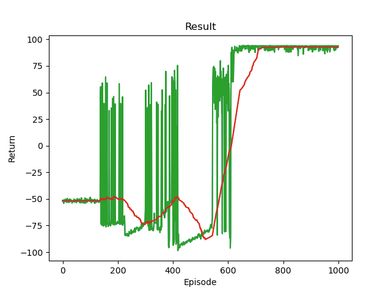

# RL_followups
Following up various RL algorithms using gymnasium and pytorch

## Mountain Car (Continuous)
- Trained with DDPG algorithm

</img>
<video src="./MC/MC_DDPG-episode-0.mp4" width="450px"></video>